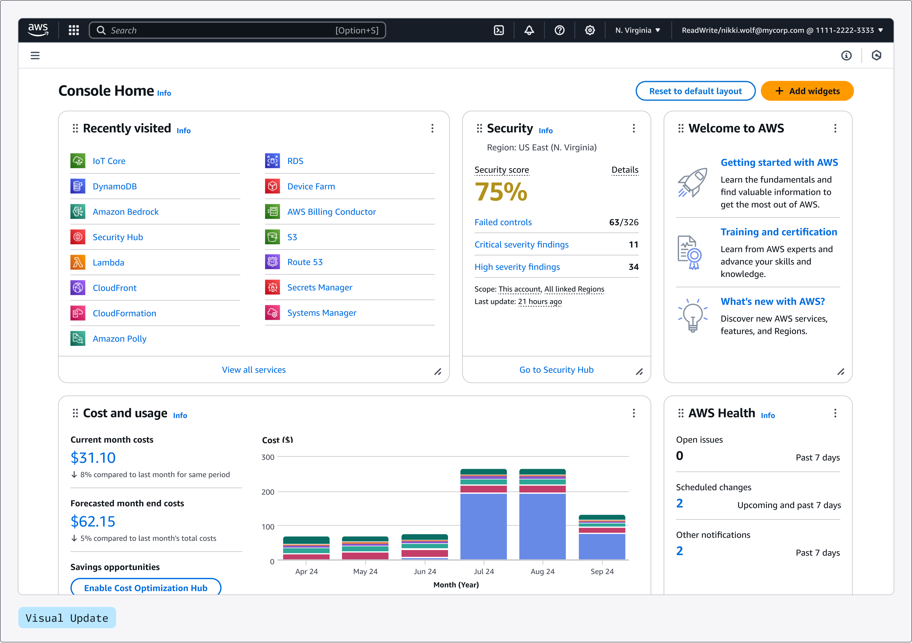
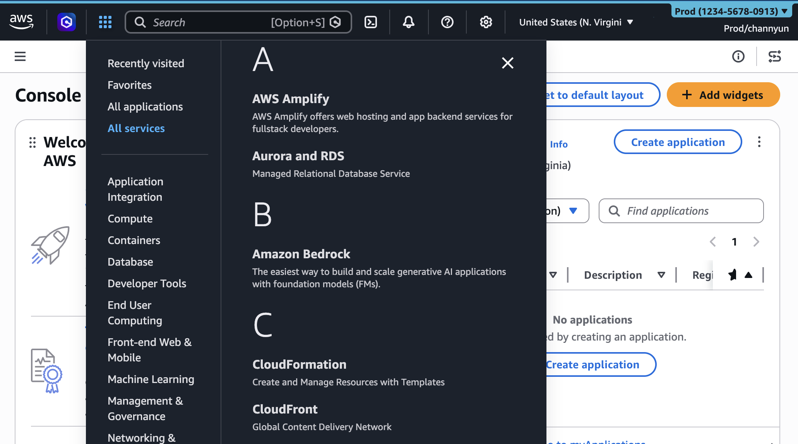
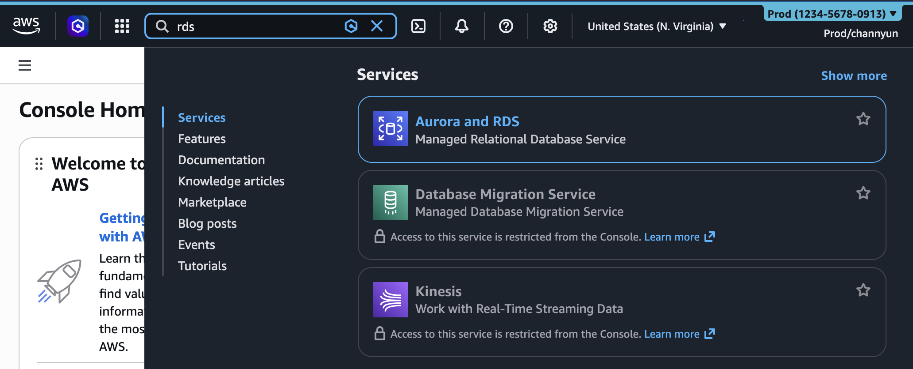
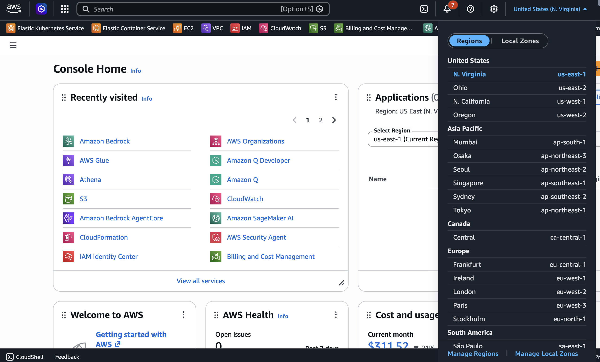
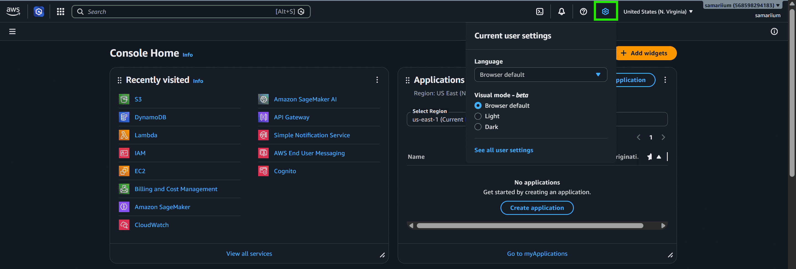
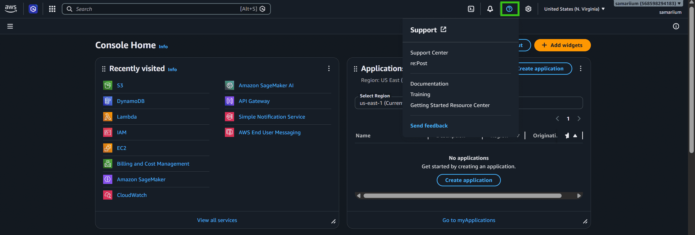
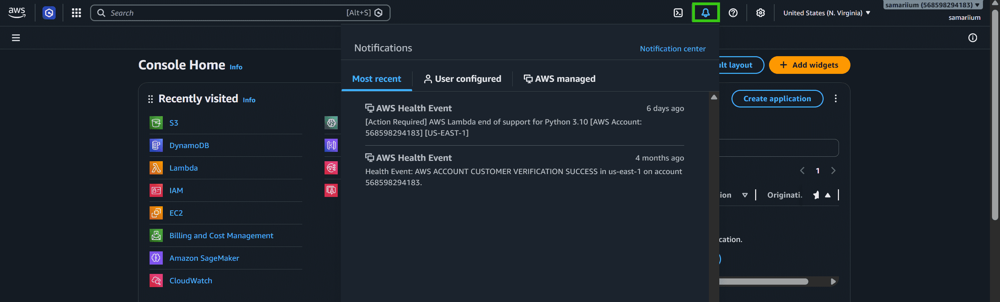
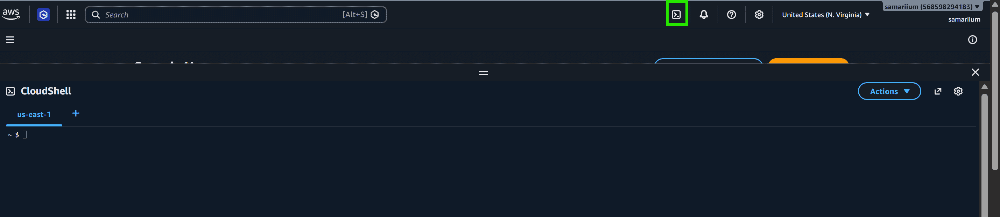

# AWS MANAGEMENT CONSOLE

- __AWS Management Console__ là UI main web giúp quản lý hầu hết các resource trên AWS bằng thao tác nhấn chuột thay vì CLI/SDK

## 1. Cấu trúc tổng thể

- Bao gồm 2 phần chính:

### 1.1. Navigation bar - Thanh điều hướng trên cùng:

- Là thanh cố định, xuất hiện ở mọi trang, mọi service
- Bao gồm:
  - __Services menu__: Xem danh sách tất cả đầy đủ mọi service của AWS, nhóm theo bảng chữ cái hoặc category (Compute, Database)
  - __Unified Search__: Cho phép tìm kiếm service, tài nguyên cụ thể, các bài blog, tài liệu AWS, bài viết kiến thức, tutorial, sự kiện, và cả sản phẩm trên AWS Marketplace (dạng Autocomplete, sử dụng phím tắt `Alt+S` hoặc `Option+S`)
  - __Region Selector__:
    - Click vào region indicator cạnh user name ddeer xem region hiện tại và chọn region khác để deploy resource
    - __Chú ý__: Resource tạo ở region __A__ sẽ không hiện ra khi đang xem region __B__ trên Console
  - __Account/Organization menu__: Hiển thị danh sách các AWS account trong Organization, cho phép switch role giữa các account
  - __Settings (Bánh răng cưa)__: Cho phép chọn ngôn ngữ hiển thị, chuyển giữa dark/light mode, và các cài đặt console khác
  - __Service Quotas, Billing & Cost Management, Security Credentials__: các menu nhanh truy cập giới hạn resource tối đa của account, dashboard billing tổng quan, và menu IAM để quản lý security credentials
  - __Support (Câu hỏi)__: Hiển thị tất cả các mục liên quan đến hỗ trợ AWS, giúp ta có thể xử lý các vấn đề lỗi với AWS service:
    - __Support Center__: chuyển hướng sang trang support dashboard
    - __Expert Help__: Giúp ta kết nối với bất kỳ chuyên gia AWS đang sẵn sàng
    - __re:Post__: Truy cập đến AWS documentation and resourcess
  - __Notifications (Chuông - thông báo)__: Hiển thị những thông báo liên quan đến các dịch vụ AWS của bạn, bao gồm tất cả các sự kiện health có thể ảnh hưởng đến tài nguyên
  - __Cloud Shell__: Browser-based shell giúp chạy AWS CLI hoặc script trên browser
  - __Amazon Q__: AI-powered assistant giups ta hiểu các dịch vụ AWS, sinh code gợi ý, xử lý vấn đề, và nhận hướng dẫn ngay trên bảng điều khiển console

### 1.2. Console Home:

- Là trang chủ của AWS, bao gồm nhiều widget có thể thêm/sửa/xoá/tuỳ biến theo yêu cầu:
  - __AWS Health__: Hiển thị các sự kiện có thể gây ảnh hưởng đến hạ tầng AWS của bạn như service outage, maintainance schedule, v.v.
  - __Cost and usage__: Tổng quan chi phí dịch vụ, chia theo từng AWS service
  - __Recently visited__: danh sách các service ta vừa truy cập gần đây
  - __Trusted Advisor__: đưa ra khuyến nghị để tuân theo best practice của AWS
  - __Applications__: cho phép chọn 1 application để vào dashboard riêng theo dõi và quản lý application đó
